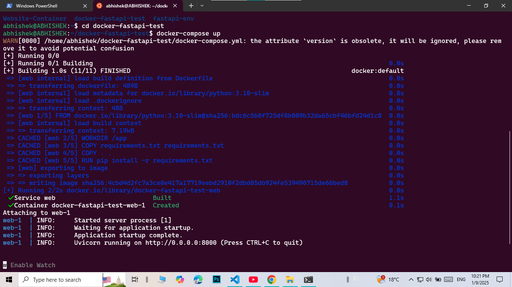
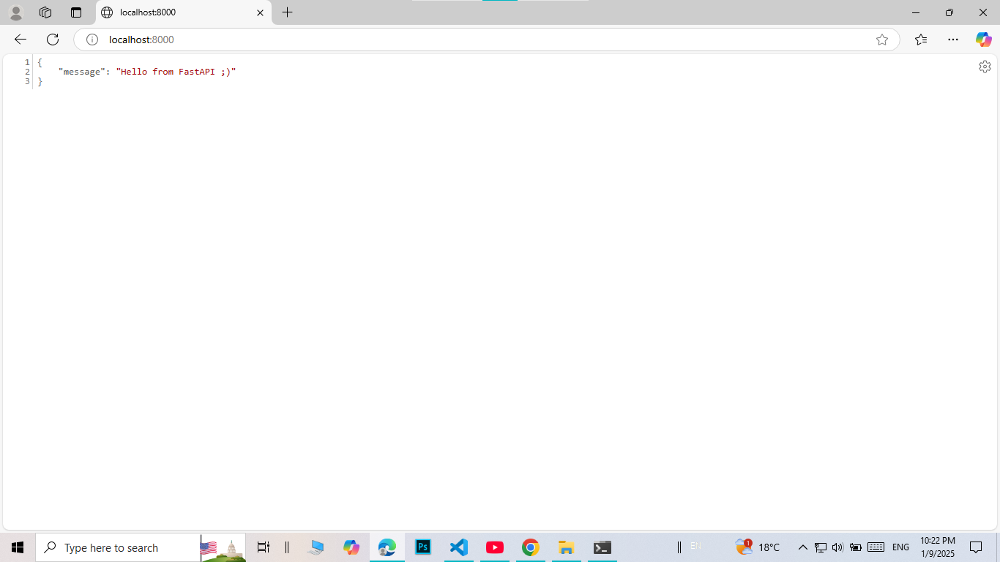
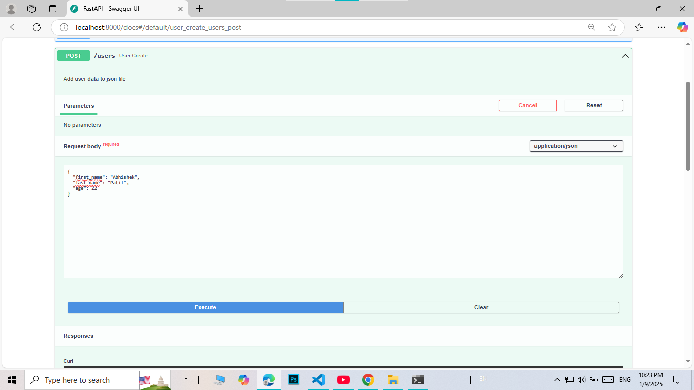
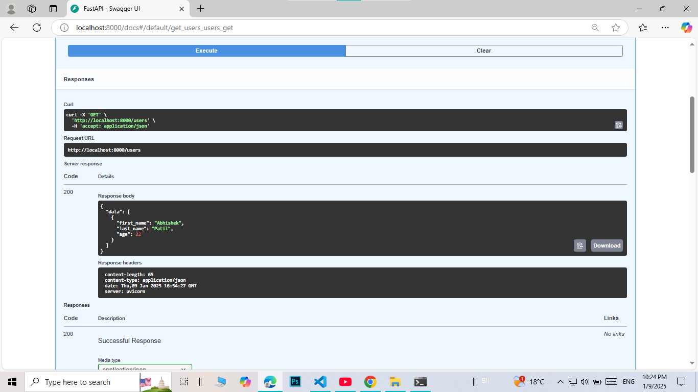

# docker-fastapi-test
<h3>Author<h3></h3>
Developed By Abhishek Patil
  

<h3> Containerizing and running app on port 8000 </h3>

 
Containerized the app using docker-compose.yml file which locates the docker file and runs the app on port 8000 which is mentioned in Dockerfile and compose file.

<h3> GET Method which returns a hello message </h3>

<h3> POST Method accepts and stores user data in JSON file </h3>

<h3> GET Method which returns a list of users stored in JSON file </h3>

<h3> User Data</h3>

User data is stored in a JSON file which is saved even after the containers are destroyed. 

<h3> docker-compose file</h3>

The volumes directive in Docker Compose creates a link between the directory on the host machine and a directory inside the Docker container. This enables data persistence. 
This will solve the problem of data getting deleted when containers are stopped and deleted. 

